  

  

  
  
  
  

### What I'm into

| Cybersecurity & forensics | AI & machine learning | Software development |
| --- | --- | --- |
| Reading packet captures to work out what really happened, finding weak spots, and spotting odd network behaviour | LLM agents, generative AI, and models that predict outcomes from data | Python tools that are built to be used, with a focus on clean, working code |

### Toolbox

### Projects

| Project | What it does | Built with |
| --- | --- | --- |
| [**Attack-Defense Agent**](https://github.com/tausif112/attack-defense-agent) | Two AI agents face off: the attacker plans a break-in from recon to data exfiltration, and the defender writes countermeasures for every stage | Python, LangGraph, Groq, Llama 3.3 70B, Streamlit |
| [**Packet Logger**](https://github.com/fuyadislam/Packet-Logger) | Captures live or recorded traffic and exports JSON, CSV and pcap, with IP, TCP, UDP and DNS support | Python, Wireshark |
| [**Network Traffic Analysis & Anomaly Detection**](https://github.com/fuyadislam/Network-Traffic-Analysis-Anomaly-Detection) | Reads JSON and JSONL traffic data, builds structured reports and flags irregular behaviour | Python |
| [**Formula 1 Race Prediction**](https://github.com/fuyadislam/formula_1_prediction) | Predicts race results from practice, qualifying, track conditions and weather | Python |

### Right now

- [x] BSc (Hons) Digital Forensics & Cybersecurity at TU Dublin (2025 to 2029)
- [x] Peer mentoring at TU Dublin since Sep 2026
- [ ] Building more with LLM agents and network analysis in Python

### Certificates

- Mastercard Cybersecurity Job Simulation (Forage, Jun 2026)
- Technical Support Fundamentals (Google, Oct 2025)
- Introduction to Generative AI (Google, Nov 2024)
